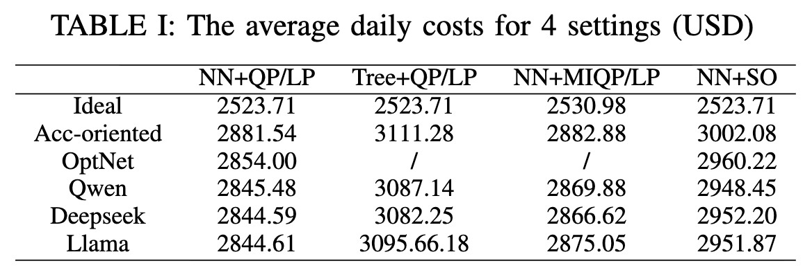
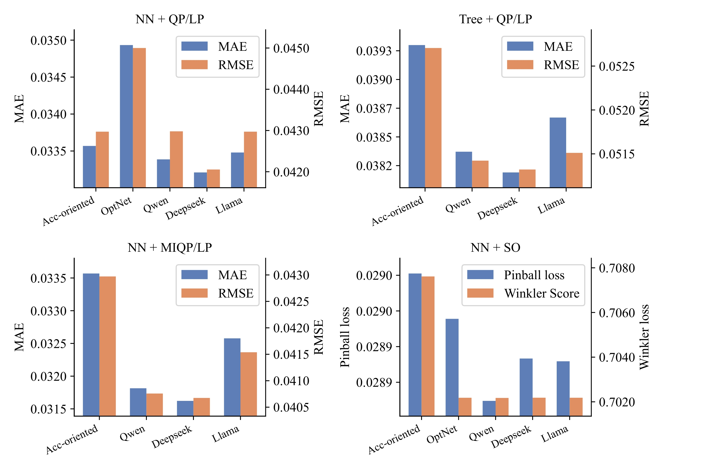
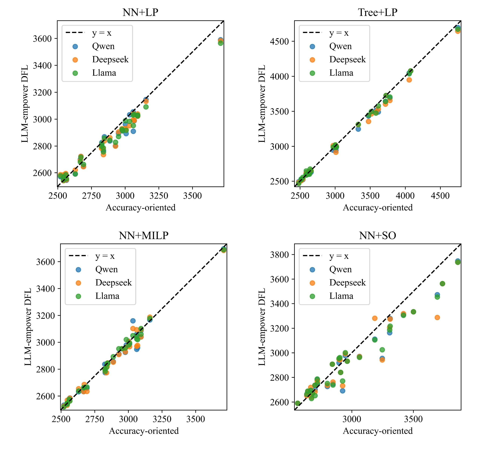
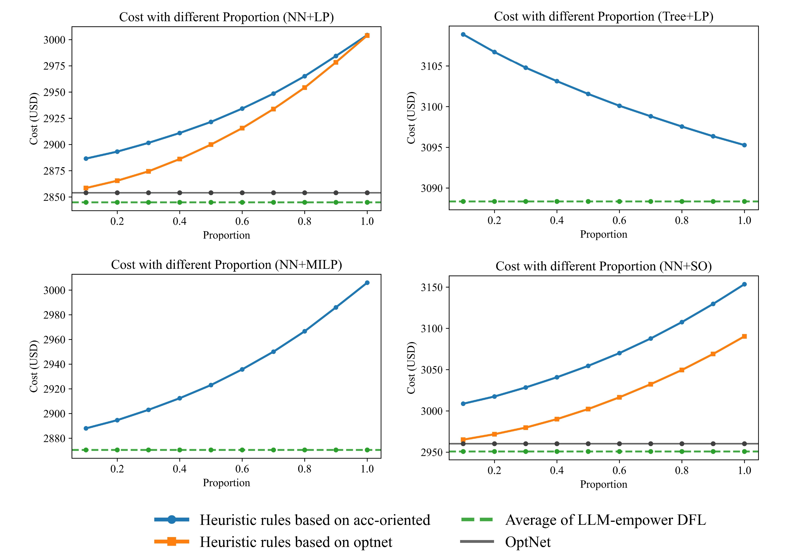
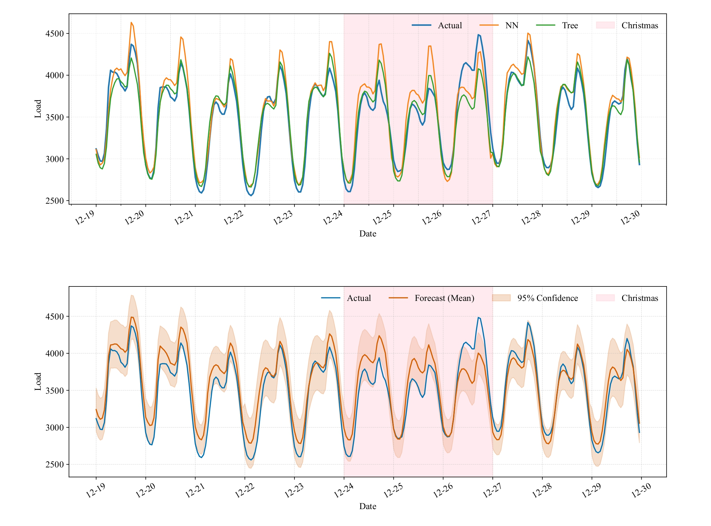
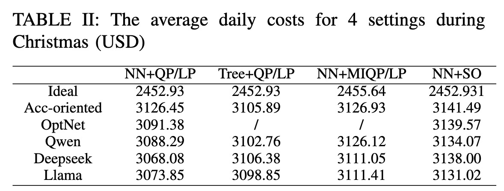
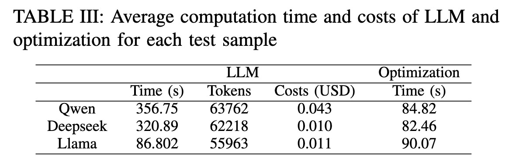

# LLM-DFL
Codes for Paper “Large Language Model-Empowered Decision-focused Learning in Local Energy Communities”, Authored by Yangze Zhou, Yu Zuo, Daniel Kirschen, Yi Wang.

Corresponding author E-mail(s): yiwang@eee.hku.hk.

## Environments
The environments for the code can be installed by
```
conda env create -f environments.yml
```
## Data
The load data used for experiments can be found in ```./Data/GEF_data```.

## Code
There are four settings in our work to show the generalization ability of our LLM-empower DFL framework.
| Filefold name      | Description |
| ----------- | ----------- |
|NN+LP   |Forecasting model is a neural network and optimization problem that ignores the integer constraints. This setting can be handled by Optnet.|
|Tree+LP|Forecasting model is a Tree model and optimization problem that ignores the integer constraints in the UC problem. Due to the tree model not being trained by gradient descent, it is hard for Optnet to train a DFL model.|
|NN+MILP|Forecasting model is a Tree model, and optimization problem is a mixed integer linear problem (MILP). It is also hard for Optnet to train a DFL model because the integer variable makes the gradient of the optimization problem hard to calculate.|
|NN+SO|The output of the forecasting model is a distribution, and the optimization is a stochastic problem (SO).|


## Result

### Operation Costs

Table. 1 shows the average daily costs of various models for 4 settings. The term Ideal denotes the theoretical costs incurred when forecasts are perfectly accurate. In contrast, Acc-oriented refers to the conventional training approach for forecasting models, which aims to minimize prediction errors.
In the settings where OptNet can be applied, our methods yield a further reduction in average daily operational costs. We quantify the extra cost as the difference between the realized operational cost and the ideal cost under perfect forecasts. Using this extra‑cost metric, our methods reduce the excess cost by 2.38\%, 2.90\%, 3.69\%, and 2.46\% on average in four settings.

 <div align="center">
 
</div>

### Forecasting accuracy

Fig. 1 shows the deterministic forecasting metrics mean absolute error (MAE) and root mean square error (RMSE), as well as the probabilistic forecasting metrics pinball loss from $5\%,10\%,\cdots,95\%$ and winkler score with upper bound 95\% and lower bound 5\%. 
Under the NN+LP setting, OptNet-based methods achieve lower operational costs despite yielding larger forecasting errors. For the setting of NN+SO, OptNet-based methods improve probabilistic forecasting performance (lower pinball loss and better Winkler scores). Moreover, our proposed methods further reduce forecasting errors relative to both OptNet-based and accuracy‑oriented baselines and consequently lead to additional cost reductions.



*Figure 1: Forecasting accuracy of different methods for four settings.*

### Statistical Visualization of the Cost Reduction

The cost comparison between the LLM-empowered DFL and the accuracy-oriented method for each test sample is shown in Fig. 2. The $x$ and $y$-axes represent the costs achieved by the accuracy-oriented baseline and the LLM-empowered DFL, respectively. Across all four settings, most points fall below the $y=x$ reference line, indicating that the LLM-empowered approach generally attains lower objective values than the accuracy-oriented baseline on the majority of instances. This distribution suggests consistent performance gains rather than random fluctuations around parity.



*Figure 2: The cost comparison of the LLM-empowered DFL with the accuracy-oriented method.*

### Comparison to Heuristic Method

This subsection provides a comparison with heuristic rule-based methods. Given the selected similar historical samples in the training set, denoted as $\hat{y}^{\text{train}}$ and $y^{\text{train}}$, we first compute the historical forecast errors:

$$
e = y^{\text{train}} - \hat{y}^{\text{train}}
$$

We then heuristically correct the current-day forecast $\hat{y}$ by adding a proportion of this historical error:

$$
\widetilde{y} = \hat{y} + \alpha e
$$

where $\alpha$ is a tunable proportion coefficient (grid-searched in our experiments).  
The corrected forecast $\widetilde{y}$ is subsequently fed into the same downstream optimization module, and the resulting operational cost is reported for comparison.


The cost comparison of the LLM-empowered DFL with the heuristic rules-based methods has been given in Fig. 3. We evaluated the effectiveness of applying these heuristic rules to both original forecasts.  
Our findings indicate that when an NN serves as the forecasting model, directly using these errors to fine-tune forecasts via heuristic rules unexpectedly led to higher costs. This suggests that enabling the forecasting model to understand downstream decision-making information for fine-tuning purposes is a more effective approach. While the heuristic rules-based method proved effective when tree-based models were used for forecasting, their performance did not surpass that of our LLM-empowered DFL framework.



*Figure 3: The cost comparison of the LLM-empowered DFL with the heuristic rules-based method.*

### Performance under OOD

Fig. 4 illustrates the forecasting dynamics during the Christmas period. Influenced by the holiday effect, the actual load plummeted on Dec. 24 and Dec. 25. Traditional models failed to capture this abrupt shift, significantly overestimating the load during the drop. Furthermore, as industrial activities resumed on Dec. 26, these models exhibited a severe lag, underestimating the rebound because their input features were dominated by the suppressed load values from the preceding holiday days.

As quantified in Table 2, our LLM-empowered DFL approach achieves lower operational costs compared to Accuracy-oriented FL and OptNet. Notably, these results were obtained without explicit "holiday" labeling in the input prompts or specialized preprocessing for similar-day searching and few-shot learning. This confirms that our proposed method exhibits robust zero-shot adaptability even in the absence of such guidance.

Beyond quantitative metrics, a key advantage of our framework is its flexibility via prompt engineering. Unlike rigid numerical models, it facilitates the explicit injection of domain knowledge. For instance, observed error patterns, such as the specific overestimation and underestimation trends during holidays, can be described in the prompt as prior experience. This enables the LLM to adjust its strategy to compensate for deviations. Similarly, for other OOD scenarios such as rapid load spikes caused by extreme weather, relevant contextual experiences can be fed into the LLM, thereby significantly enhancing the method's robustness where traditional models might fail.



*Figure 4: The deterministic and probabilistic forecasting results from 19 Dec. to 29 Dec 2013.*

<div align="center">
  
</div>

### Computation complexity and costs analysis

The average LLM call latency, token usage, and API cost, together with the optimization solving time for each test sample in Setting NN+MILP are listed in Table 3. The average processing time is dominated by (i) LLM inference and (ii) solving the MILP. Specifically, the LLM inference time ranges from 86.80\,s (Llama) to 356.75\,s (Qwen), while the optimization solver takes about 82--90\,s per instance. The processing time is acceptable for our real-time operations in practice.

We also estimated the monetary cost of commercial LLM APIs based on the recorded token usage. The API cost is approximately \$0.010--\$0.043 per test instance (Deepseek/Qwen), which is negligible compared with the operational dispatch cost and the dispatch-cost savings enabled by our method. Therefore, the LLM calling cost does not offset the achieved economic benefits under the studied setting.

<div align="center">
  
</div>
